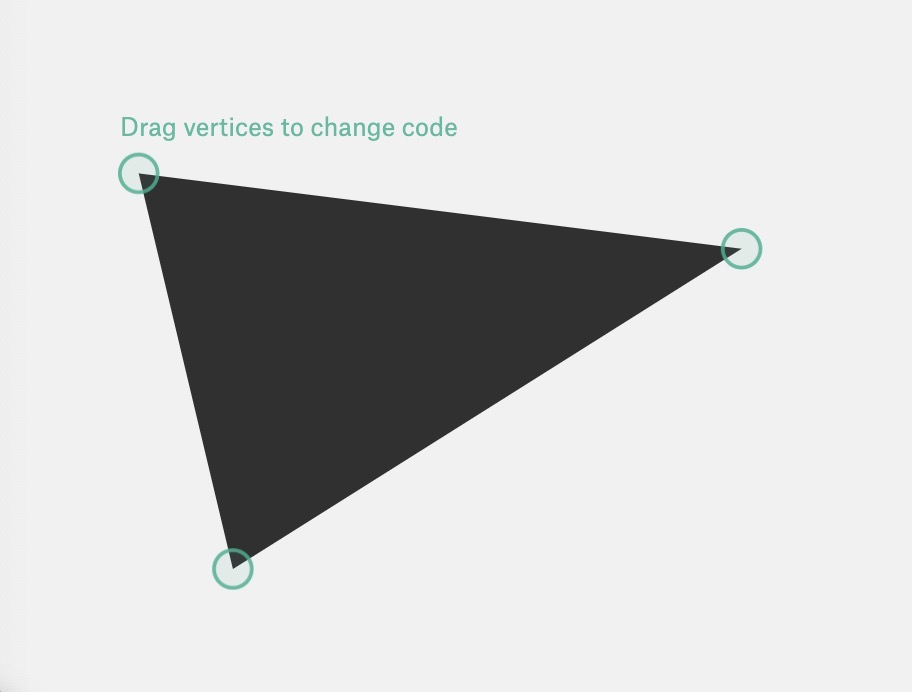
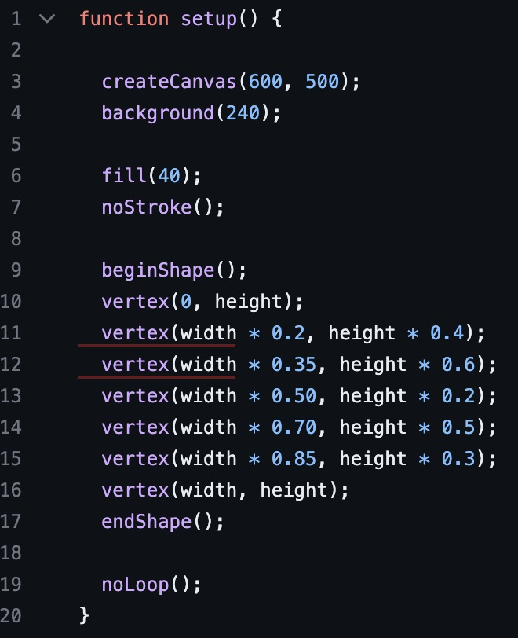

# aaim3708_9103_tut6

## part1: Picture Technique Inspiration
I discovered fractal art, which uses the principle of fractal geometry and the powerful computing power of computers to iteratively calculate mathematical formulas, and then combines the author's aesthetic and artistic shaping to transform abstract and mysterious mathematical formulas into exquisite artistic paintings.  Fractal art can show colorful visual effects, attract the attention of the audience, and can also express complex information or emotion2.

## part2: Coding Technique Exploration
Use some transformation functions provided by p5.js, such as translate(), rotate(), scale(), etc., to change the position, direction and size of the fractal pattern, so as to generate more complex and diverse fractal patterns. Use some color functions provided by p5.js, such as stroke(), fill(), colorMode(), etc., to set the color, transparency and mode of the fractal pattern, so as to increase the beauty and visual effect of the fractal pattern. Use some control functions provided by p5.js, such as setup(), draw(), mousePressed(), etc., to control the generation and display process of fractal patterns, so as to achieve dynamic and interactive fractal art.

[Code Link](https://programmingdesignsystems.com/shape/custom-shapes/index.html)